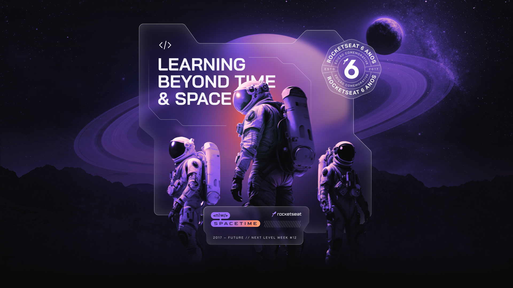
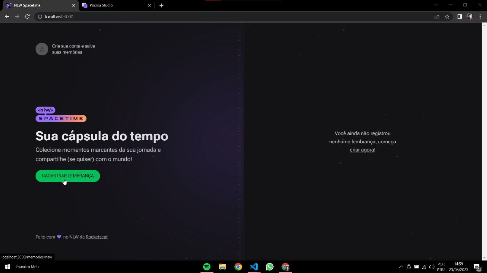
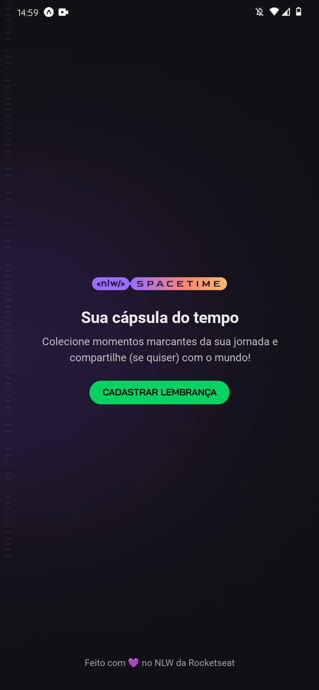

  

  
  

## 💻 Projeto
<h1 align="center"> Cápsula do Tempo | NLW Spacetime </h1>

Aplicação de recordação de memórias, onde o usuário poderá adicionar à uma timeline textos, fotos e vídeos de acontecimentos marcantes da sua vida, organizados por mês e ano.

  

## Stack utilizada

**Front-end:** Nextjs, Typescript, TailwindCSS

**Back-end:** NodeJS, Typescript, Fastify, Prisma

**Mobile:** React Native, Expo, Typescript, Nativewind

# Preview

## Web

  

## Mobile

  

